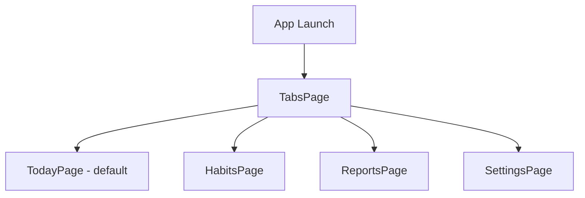
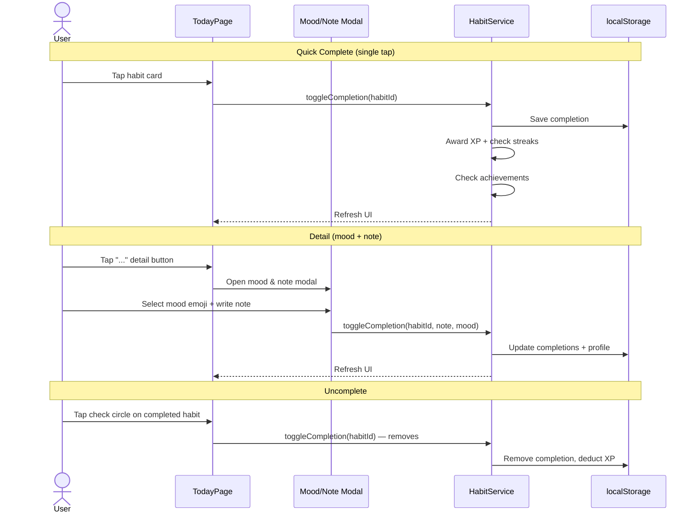
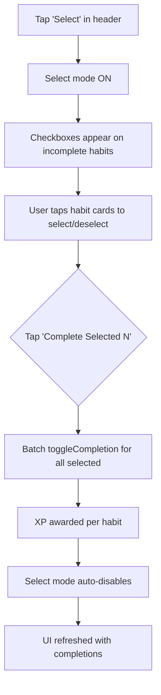
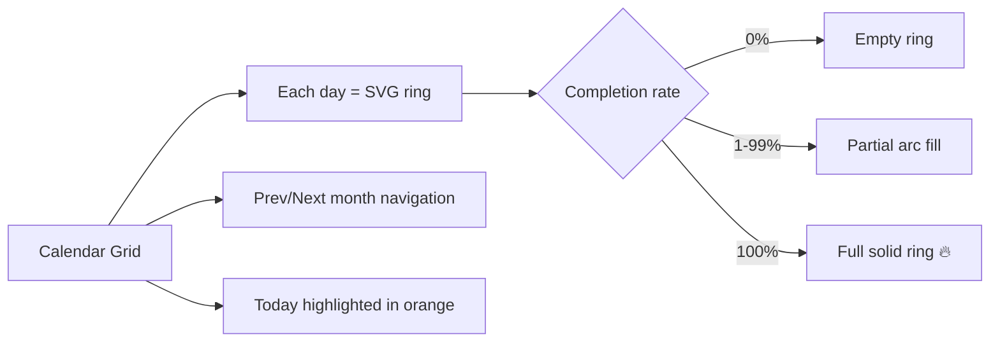
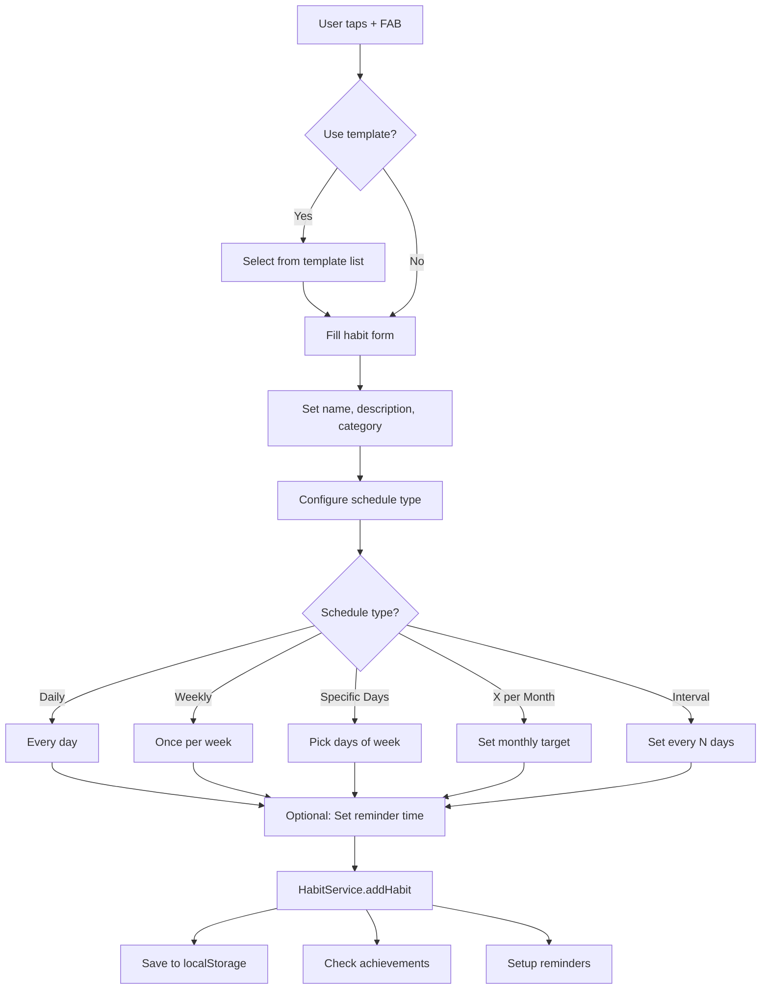
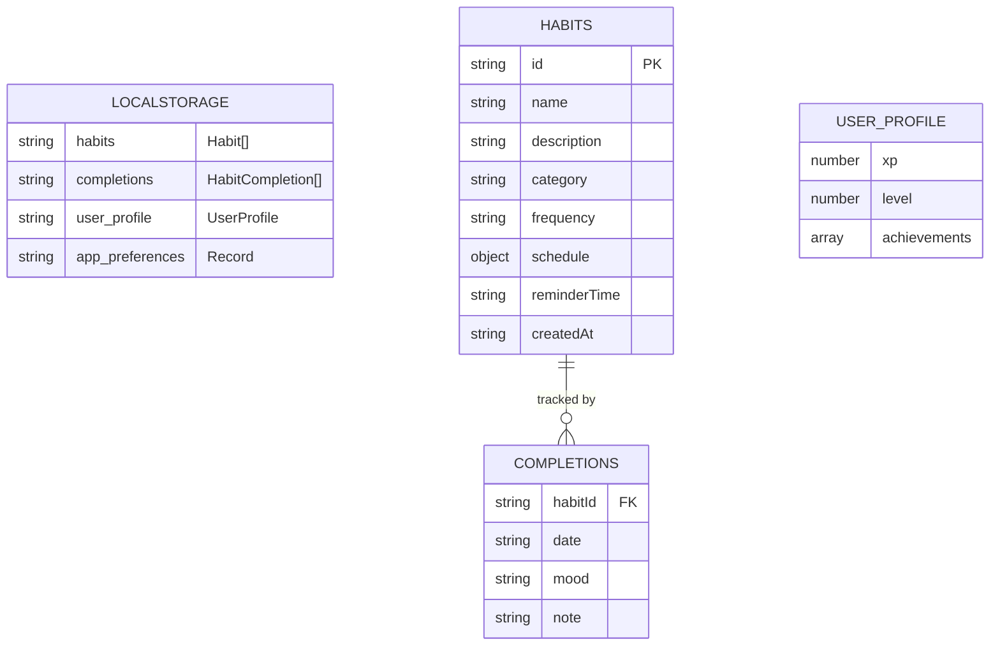

# 🧠 Habit Tracker

A full-featured habit tracking mobile app built with **Angular 21**, **Ionic**, **PrimeNG**, and **Tailwind CSS**. Track daily habits, build streaks, earn achievements, and gain insights into your progress.


---

## 📋 Features

### ✅ Habit Management
- Create, edit, and delete habits
- Categorize habits: Health, Work, Personal, Fitness, Learning, Custom
- Color-coded categories for visual clarity
- Habit templates for quick setup (Drink Water, Meditate, Exercise, Read, etc.)

### ⚡ Quick Complete & Multi-Complete
- **Quick Complete** — single tap on a habit card instantly marks it done
- **Detail button ("...")** — add mood emoji + notes to any completion
- **Select Mode** — toggle from header, pick multiple habits, batch-complete in one tap

### 📅 Activity Calendar (Fitness Rings)
- Apple Fitness-style **SVG rings** showing daily completion rate for the month
- Full ring = 100% of habits done, partial arc = partial completion
- Today highlighted, future days greyed out
- Month navigation with prev/next arrows

### 📅 Flexible Scheduling
- **Daily** — every day
- **Weekly** — once per week
- **Specific Days** — pick days of the week (Mon, Wed, Fri, etc.)
- **X per Month** — configurable monthly targets
- **Interval** — every N days

### 🔥 Streaks & Gamification
- Current and best streak tracking per habit
- XP system with leveling
- Achievements: First Habit, 7-Day Streak, 30-Day Streak, Perfect Week, Level 5/10, etc.
- Progress tracking toward goals

### 😊 Mood Logging
- Log mood with each habit completion (😊 😐 😔 😤 🔥)
- Optional notes per completion

### 📊 Reports & Analytics
- Weekly and monthly completion rates per habit
- Visual stats and progress tracking

### ⏰ Reminders
- Set reminder times per habit (HH:mm)
- In-app notification reminders

### 🌙 Dark Mode
- Toggle dark/light theme from settings
- Defaults to dark mode

### 📤 Settings & Data
- Export/import habit data
- Share functionality
- Preference persistence via localStorage

---

## 🏗 Tech Stack

| Technology | Purpose |
|---|---|
| **Angular 21** | Frontend framework |
| **Ionic** | Mobile UI components + Capacitor |
| **PrimeNG** | Additional UI components |
| **Tailwind CSS** | Utility-first styling |
| **Capacitor** | Native iOS & Android builds |
| **TypeScript** | Type safety |
| **Playwright** | E2E testing |

---

## 📁 Folder Structure

```
habit-tracker/
├── src/
│   ├── app/
│   │   ├── models/
│   │   │   └── habit.model.ts        # All interfaces, types, constants (Habit, HabitCompletion, Achievement, templates, etc.)
│   │   ├── services/
│   │   │   └── habit.service.ts       # Core service — CRUD, completions, streaks, XP, achievements, persistence (localStorage)
│   │   ├── pages/
│   │   │   ├── today/
│   │   │   │   └── today.page.ts      # Daily view — check off habits, log mood/notes, streak display
│   │   │   ├── habits/
│   │   │   │   └── habits.page.ts     # Habit list — create, edit, delete, templates, category filter
│   │   │   ├── reports/
│   │   │   │   └── reports.page.ts    # Stats & analytics — streaks, rates, progress
│   │   │   └── settings/
│   │   │       └── settings.page.ts   # Preferences — dark mode, export/import, about
│   │   ├── app.tabs.ts                # Tab bar layout (Today, Habits, Reports, Settings)
│   │   ├── app.routes.ts              # Route definitions (lazy-loaded pages)
│   │   ├── app.config.ts              # Angular app configuration
│   │   ├── app.ts                     # Root component
│   │   └── app.html                   # Root template
│   ├── index.html
│   └── main.ts                        # Bootstrap entry
├── android/                           # Capacitor Android project
├── ios/                               # Capacitor iOS project
├── e2e/                               # Playwright E2E tests
├── capacitor.config.ts
├── angular.json
├── tailwind / postcss configs
└── package.json
```

---

## 🔀 Application Flow

### Navigation


### Habit Completion Flow


### Multi-Complete Flow


### Activity Calendar


### Habit Creation Flow


### Data Persistence


---

## 🚀 Getting Started

```bash
# Install dependencies
npm install

# Development server
ng serve
# → http://localhost:4200

# Build for production
ng build

# Run E2E tests
npx playwright test

# Native builds (Capacitor)
npx cap sync
npx cap open ios      # Xcode
npx cap open android  # Android Studio
```

---

## 📝 Change Log

### 🚀 Quick Complete, Multi-Complete & Activity Calendar (latest)
- Single tap on habit card = instant complete (no mood modal)
- "..." detail button for adding mood/note to any habit
- Select mode with batch complete for multiple habits at once
- Activity calendar with SVG fitness rings showing daily completion rates
- Month navigation with prev/next arrows

### 📱 Capacitor Integration
- Added Capacitor with iOS and Android platform support
- Native build ready

### 🔧 UI Polish
- Reduced bottom spacing above tab bar
- Fixed scroll content hidden behind tab bar (bottom spacers + `::part(scroll)` padding)
- Fixed FAB positioning, added back buttons, fullscreen `ion-content` on all pages

### 🎨 Mobile-First Redesign
- Clean warm UI with Sora + DM Sans typography
- FAB bug fix
- Mobile-optimized layout

### 🎉 Initial Release
- Full habit CRUD with categories
- Flexible scheduling (daily, weekly, specific days, x/month, interval)
- Streak tracking + XP/leveling + achievements
- Mood logging with emoji + notes
- Reports with weekly/monthly rates
- Dark mode toggle
- Habit templates
- Reminders
- Export/import data
- localStorage persistence
